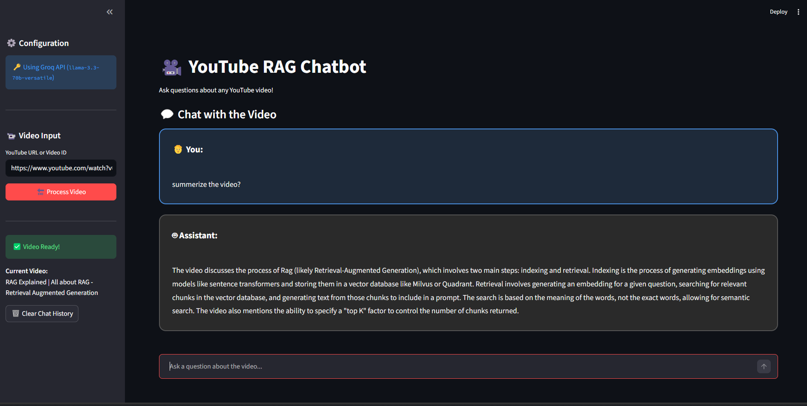

# 🎥 YouTube RAG Chatbot

A Streamlit web app that lets you chat with any YouTube video. Paste a video URL, and the app automatically extracts the transcript, builds a retrieval-augmented generation (RAG) pipeline, and lets you ask questions about the video content — with fast, accurate answers powered by Groq's `llama-3.3-70b-versatile` model.

No manual transcript upload needed — just drop a link and start asking questions.



## ✨ Features

- **Direct YouTube extraction** — pulls transcripts automatically using `yt-dlp`, no manual uploads required
- **Full RAG pipeline** — transcript → chunking → embeddings → vector store → retrieval → LLM-generated answer
- **Fast inference** — powered by the Groq API (free tier) running `llama-3.3-70b-versatile`
- **Semantic search** — embeddings generated with `sentence-transformers` (`all-MiniLM-L6-v2`) and stored in ChromaDB
- **Clean chat UI** — dark-themed, minimal Streamlit interface
- **Easy deployment** — ready to deploy on Streamlit Community Cloud

## 🧠 How It Works

1. **Input** — User pastes a YouTube video URL
2. **Transcript Extraction** — `yt-dlp` fetches the video's transcript/subtitles
3. **Chunking** — Transcript is split into smaller overlapping chunks for better retrieval
4. **Embedding** — Each chunk is embedded using `sentence-transformers/all-MiniLM-L6-v2`
5. **Vector Storage** — Embeddings are stored in a local ChromaDB vector store
6. **Retrieval** — When a user asks a question, the most relevant chunks are retrieved via similarity search
7. **Generation** — Retrieved context + question are passed to Groq's `llama-3.3-70b-versatile` via LangChain to generate a grounded answer

## 🛠️ Tech Stack

| Component | Technology |
|---|---|
| Frontend / UI | Streamlit |
| Transcript Extraction | yt-dlp |
| Embeddings | sentence-transformers (all-MiniLM-L6-v2) |
| Vector Store | ChromaDB |
| LLM Orchestration | LangChain |
| LLM Inference | Groq API (llama-3.3-70b-versatile) |
| Deployment | Streamlit Community Cloud |

## 📦 Installation

```bash
# Clone the repository
git clone https://github.com/<your-username>/youtube-rag-chatbot.git
cd youtube-rag-chatbot

# Create a virtual environment
python -m venv venv
source venv/bin/activate   # On Windows: venv\Scripts\activate

# Install dependencies
pip install -r requirements.txt
```

## 🔑 Environment Variables

Create a `.env` file in the project root with your Groq API key:

```env
GROQ_API_KEY=your_groq_api_key_here
```

> Get a free Groq API key at [console.groq.com](https://console.groq.com)

## 🚀 Usage

```bash
streamlit run app.py
```

Then open your browser at `http://localhost:8501`, paste a YouTube video URL, and start asking questions about its content.

## 📁 Project Structure

```
youtube-rag-chatbot/
├── app.py                # Main Streamlit app
├── requirements.txt      # Python dependencies
├── .env                  # API keys (not committed)
├── .gitignore
└── README.md
```

## ☁️ Deployment (Streamlit Community Cloud)

1. Push this repository to GitHub
2. Go to [share.streamlit.io](https://share.streamlit.io) and connect your GitHub account
3. Select this repo and set the main file as `app.py`
4. Add `GROQ_API_KEY` under **Secrets** in the app settings
5. Deploy 🎉

## ⚠️ Limitations

- Only works with YouTube videos that have available captions/subtitles
- Transcript quality depends on auto-generated or uploaded captions
- Groq's free tier has rate limits

## 📄 License

This project is open source and available under the [MIT License](LICENSE).

## 🙌 Acknowledgements

- [yt-dlp](https://github.com/yt-dlp/yt-dlp)
- [Sentence Transformers](https://www.sbert.net/)
- [ChromaDB](https://www.trychroma.com/)
- [LangChain](https://www.langchain.com/)
- [Groq](https://groq.com/)
